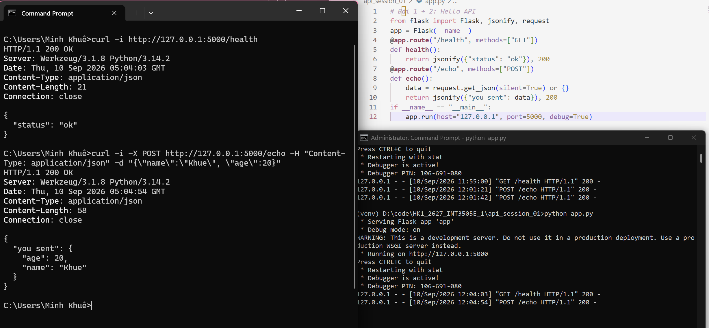
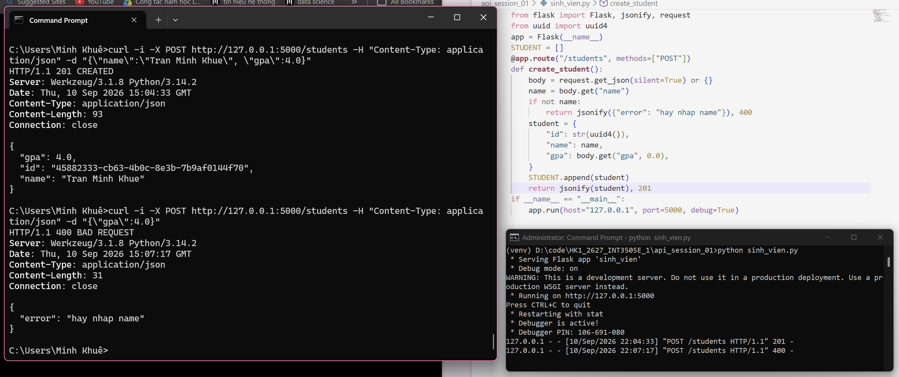

# Kết quả chạy Week 1
## Bài 1: Hello API

## Bài 2:

## Bài 3:

## Bài 4:
C:\Users\Minh Khuê>curl -i http://127.0.0.1:5000/students/1
HTTP/1.1 200 OK
Server: Werkzeug/3.1.8 Python/3.14.2
Date: Fri, 11 Sep 2026 18:16:32 GMT
Content-Type: application/json
Content-Length: 55
Connection: close

{
  "gpa": 4.0,
  "id": "1",
  "name": "Tran Minh A"
}

C:\Users\Minh Khuê>curl -i "http://127.0.0.1:5000/students?gpa=3.6&name=a"
HTTP/1.1 200 OK
Server: Werkzeug/3.1.8 Python/3.14.2
Date: Fri, 11 Sep 2026 18:19:57 GMT
Content-Type: application/json
Content-Length: 174
Connection: close

{
  "students": [
    {
      "gpa": 4.0,
      "id": "1",
      "name": "Tran Minh A"
    },
    {
      "gpa": 3.8,
      "id": "4",
      "name": "Pham Van D"
    }
  ]
}

## Bài 6: mở rộng
127.0.0.1 - - [13/Sep/2026 01:13:23] "PUT /students/1 HTTP/1.1" 200 -
127.0.0.1 - - [13/Sep/2026 01:15:29] "GET /students HTTP/1.1" 200 -
127.0.0.1 - - [13/Sep/2026 01:16:28] "GET /students?gpa=3.6 HTTP/1.1" 200 -
127.0.0.1 - - [13/Sep/2026 01:17:43] "POST /students/1 HTTP/1.1" 405 -
127.0.0.1 - - [13/Sep/2026 01:18:23] "POST /students HTTP/1.1" 201 -
127.0.0.1 - - [13/Sep/2026 01:19:40] "DELETE /students/1 HTTP/1.1" 409 -
127.0.0.1 - - [13/Sep/2026 01:20:47] "POST /students HTTP/1.1" 201 -
127.0.0.1 - - [13/Sep/2026 01:20:52] "DELETE /students/6 HTTP/1.1" 204 -
