# BTVN Tuần 3:
## Lab 1
1. Xác định các resource trong miền
- 'posts': /users/[id]/posts
- 'comments': /posts/[pid]/comments
- 'tags': /posts/[pid]/tags
- 'profile': /users/[id]/profile
- 'follow': /users/[id]/following

2. Phân loại collection/item/sub-resource
- collection: 
    * /users
    * /posts
- item:
    * /users/[id]
    * /posts/[pid]
    * /comments/[cid]
    * /tags/[tag_name]
- sub-resources:
    * /users/[id]/profile
    * /users/[id]/following
    * /users/[id]/followers
    * /users/[id]/posts
    * /posts/[pid]/tags
    * /posts/[pid]/comments
    * /tags/[tag_name]/posts

3. Vẽ sơ đồ endpoints tree và quyết định version segment
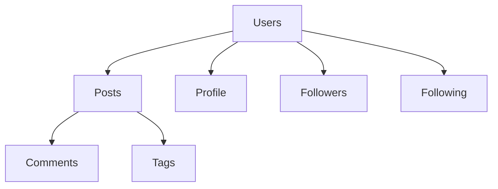
4. Triển khai Flask routes cho collection /posts
- GET /users
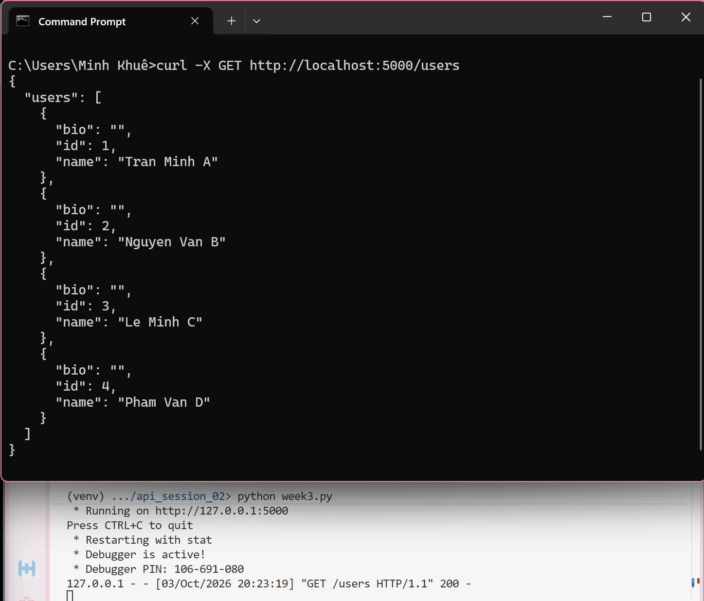
- POST /users
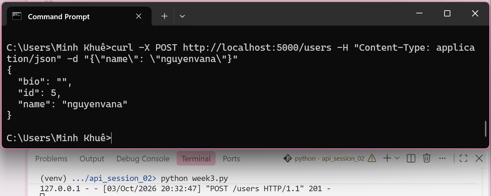
- GET /posts
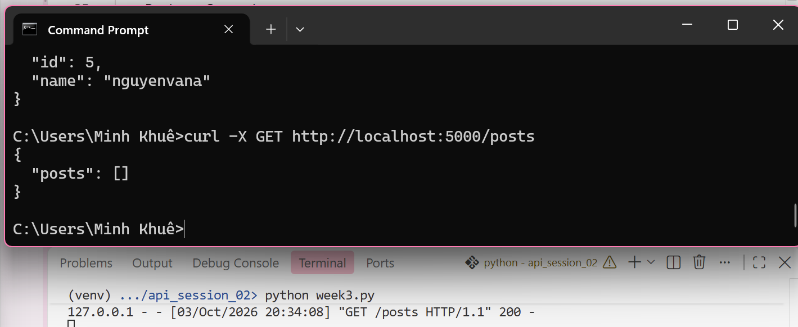
- POST /posts
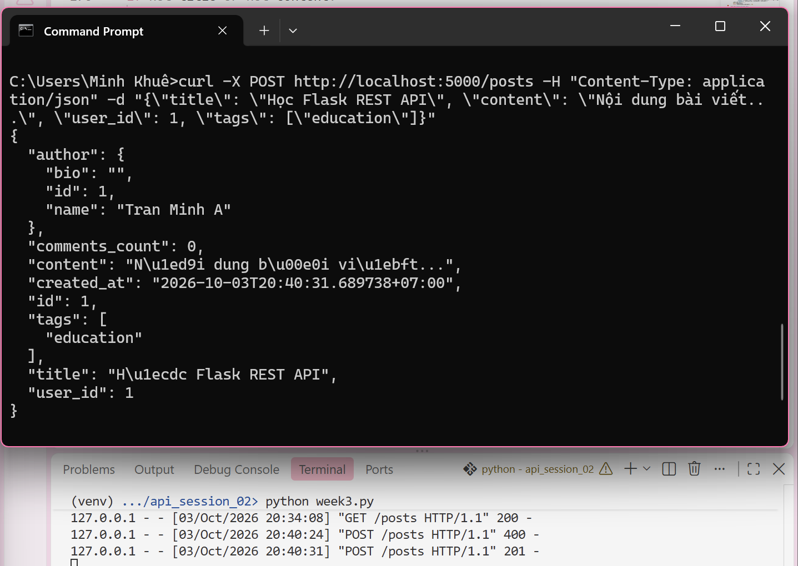
- GET /users/[id]
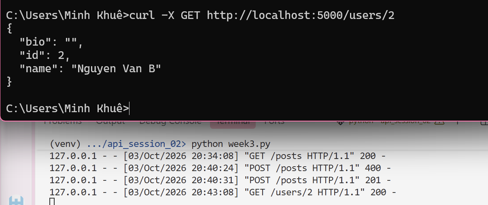
- PUT /posts/[pid]
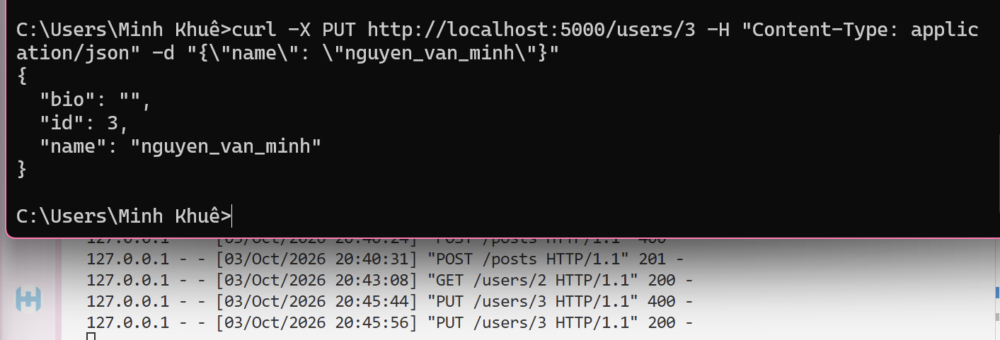
- DELETE /users/[id]
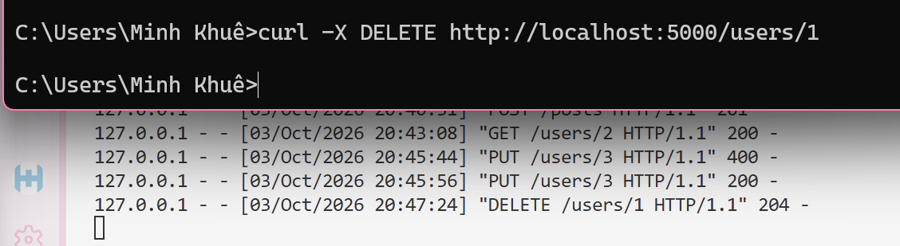
- GET /posts/[pid]
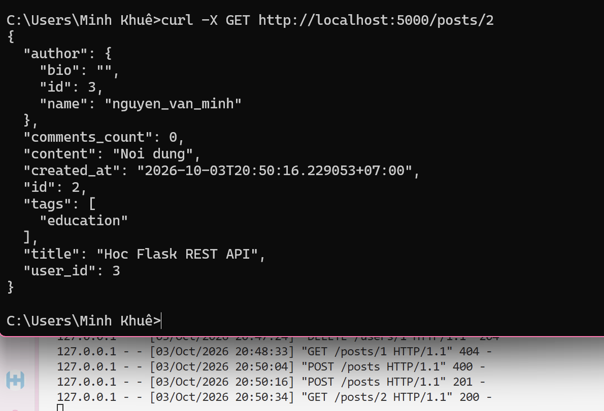
- GET /tags/[tag_name]/posts
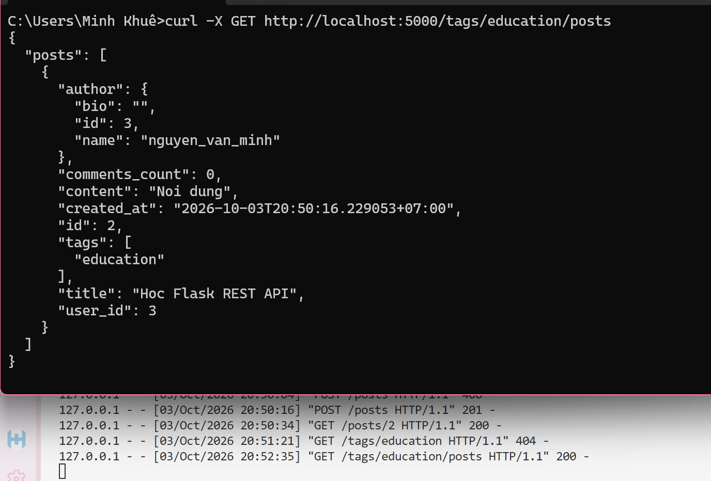
- POST /users/[id]/following
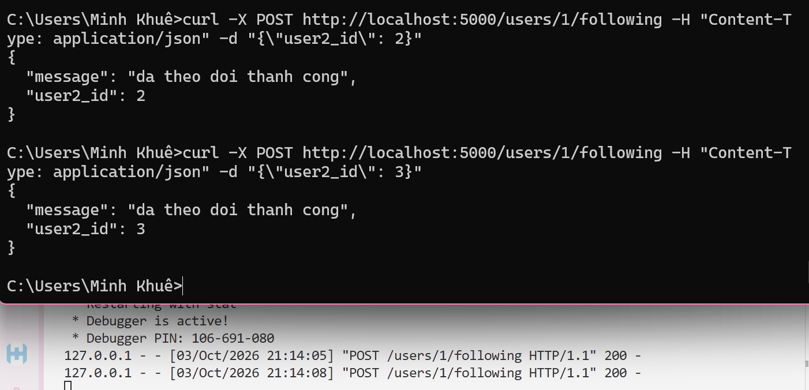

## Lab 2
- Error handler
    * GET /users/[id] với id không hợp lệ
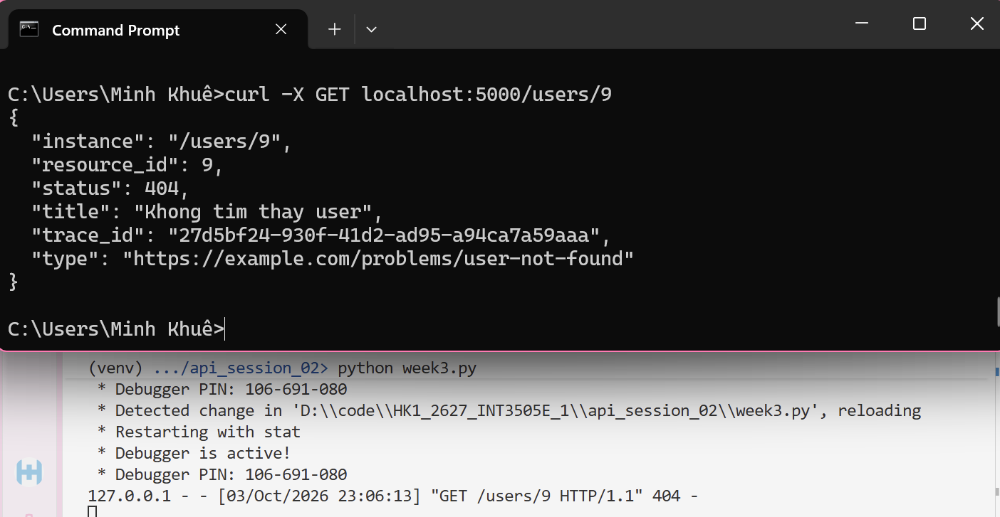
    * POST /users với content không hợp lệ
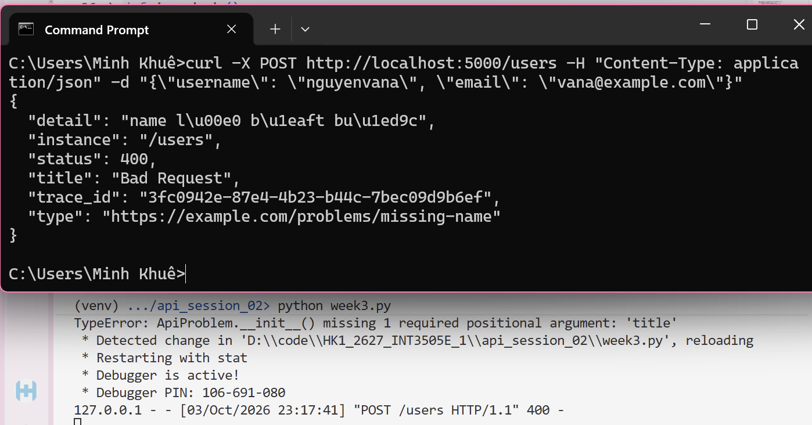